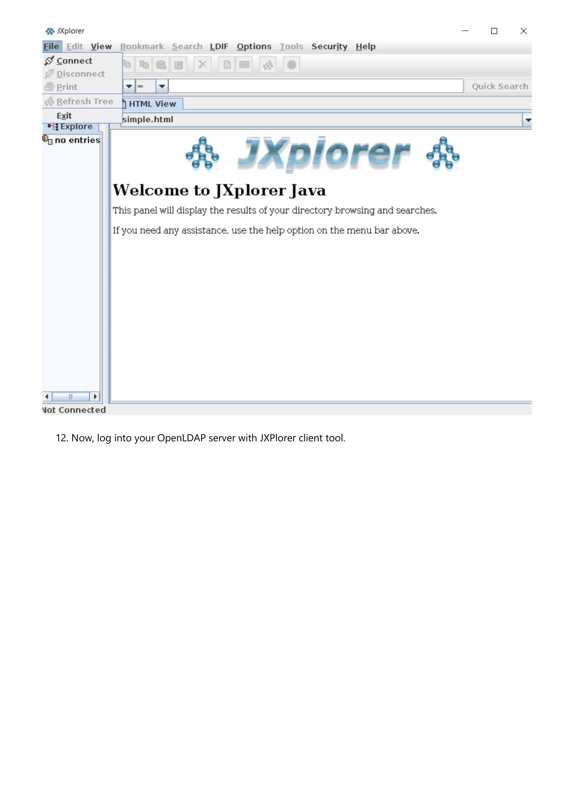
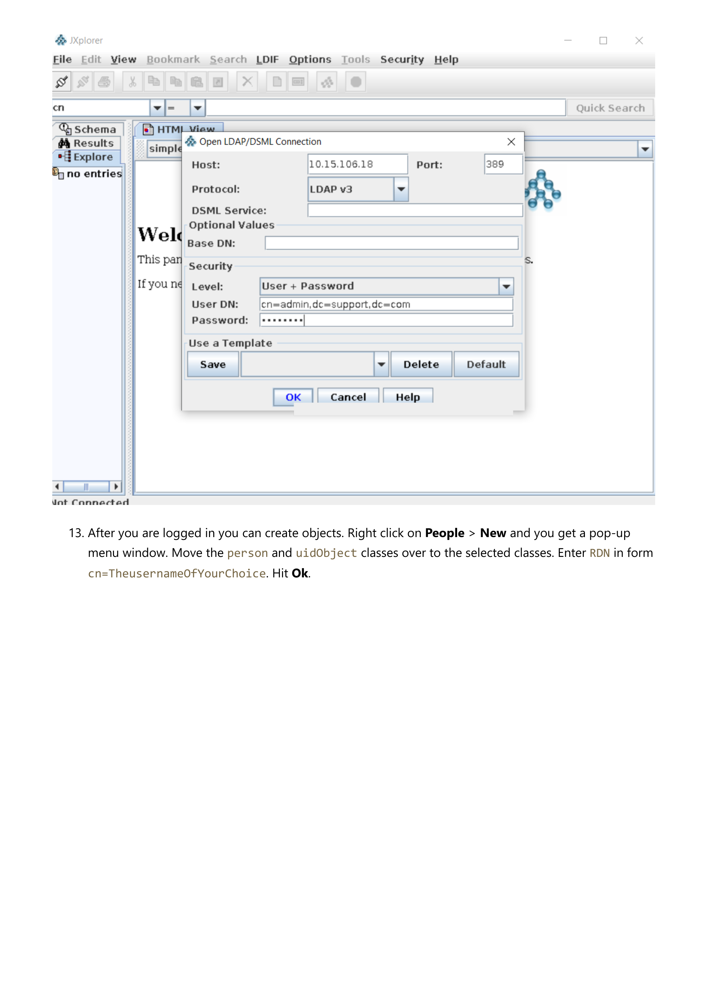
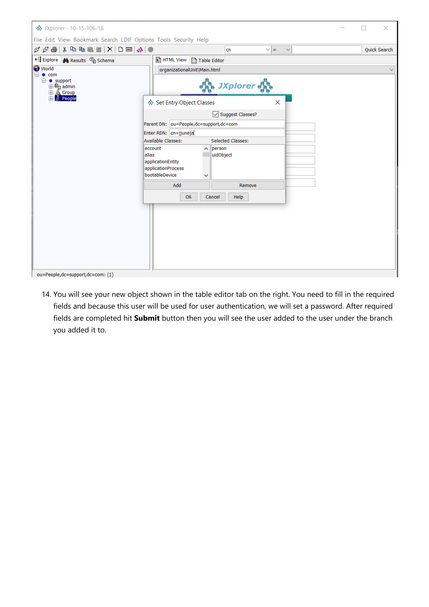
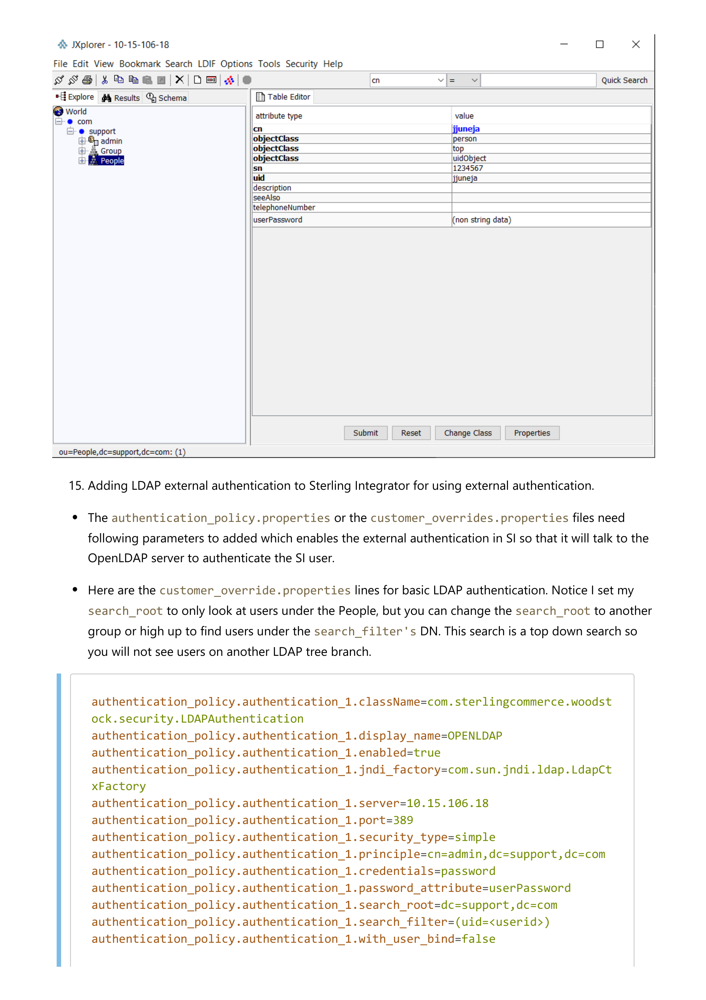
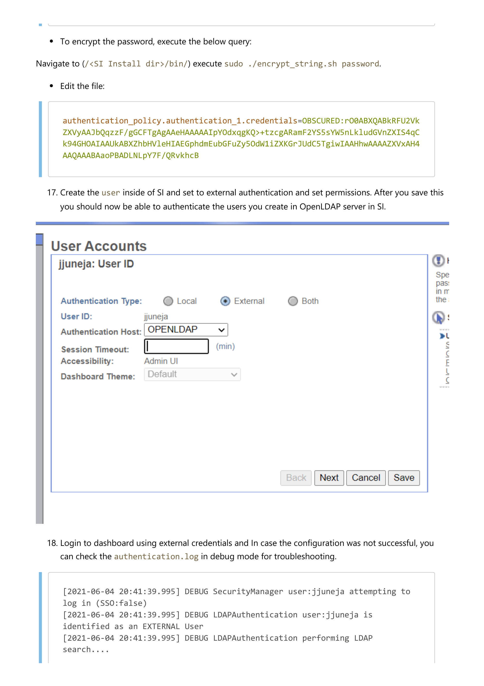
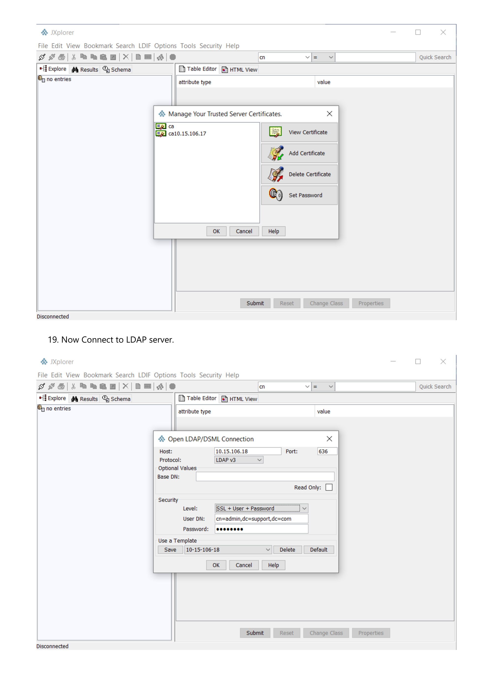
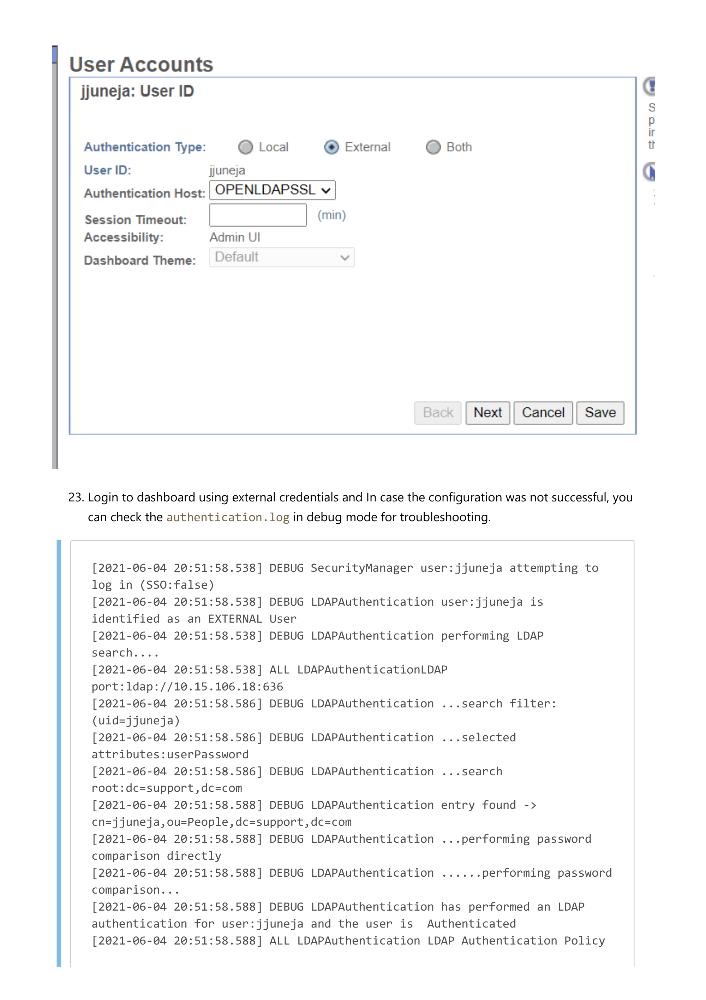

# LDAP Installation and Setup with Sterling B2B Integrator

## Author
Jaanvi Juneja (jaanvi.juneja@precisely.com), Associate Support Engineer, IBM Sterling B2B Integrator

## 1) OpenLDAP with Non-SSL
We will install OpenLDAP server on Linux machine.
1) Update the system using `yum update` (optional).
2) Install the packages required for OpenLDAP.
```console
[root@server ~]# yum -y install openldap compat-openldap openldap-clients openldap-servers openldap-servers-sql openldap-devel
```
>Expected versions:
>* `compat-openldap.x86_64 1:2.3.43-5.el7`
>* `openldap-clients.x86_64 0:2.4.44-22.el7`
>* `openldap-devel.x86_64 0:2.4.44-22.el7`
>* `openldap-servers.x86_64 0:2.4.44-22.el7`
3) Start and enable the LDAP service.
```console
[root@server ~]# systemctl start slapd
[root@server ~]# systemctl enable slapd
Created symlink from /etc/systemd/system/multi-user.target.wants/slapd.service to /usr/lib/systemd/system/slapd.service
```
4) Set a LDAP `root` password and save the output.
```console
[root@server ~]# slappasswd
New password: <Type password here, it will not be visible>
Re-enter new password:
{SSHA}0/0M8zkS7ODyRWv6rp/qXtiySXBORkcV
```
5) Configure OpenLDAP.
Create the `db.ldif` file in the `/etc/openldap/` directory with the following
contents and save it.
>```properties
>dn: olcDatabase={2}hdb,cn=config
>changetype: modify
>replace: olcSuffix
>olcSuffix: dc=support,dc=com
>
>dn: olcDatabase={2}hdb,cn=config
>changetype: modify
>replace: olcRootDN
>olcRootDN: cn=admin,dc=support,dc=com
>
>dn: olcDatabase={2}hdb,cn=config
>changetype: modify
>replace: olcRootPW
>olcRootPW: hashed_output_from_the_slappasswd_command
>olcRootPW: {SSHA}0/0M8zkS7ODyRWv6rp/qXtiySXBORkcV
Deploy the configuration using `ldapmodify`.
```console
[root@server openldap]# ldapmodify -Y EXTERNAL -H ldapi:/// -f db.ldif
SASL/EXTERNAL authentication started
SASL username: gidNumber=0+uidNumber=0,cn=peercred,cn=external,cn=auth
SASL SSF: 0
modifying entry "olcDatabase={2}hdb,cn=config"
modifying entry "olcDatabase={2}hdb,cn=config"
modifying entry "olcDatabase={2}hdb,cn=config"
```
### Common Errors

```console
[root@server openldap]# ldapmodify -Y EXTERNAL -H ldapi:/// -f db.ldif
SASL/EXTERNAL authentication started
SASL username: gidNumber=0+uidNumber=0,cn=peercred,cn=external,cn=auth
SASL SSF: 0
ldapmodify: wrong attributeType at line 5, entry "olcDatabase={2}hdb,cn=config"
```

Remove all the unwanted spaces from `.ldif` file.

6) Now restrict monitor access only to the ldap user.
Create `monitor.ldif` file in the openldap directory with the following
contents and save it.
>```properties
>dn: olcDatabase={1}monitor,cn=config
>changetype: modify
>replace: olcAccess
>olcAccess: {0}to * by dn.base="gidNumber=0+uidNumber=0,cn=peercred,cn=external, cn=auth" read by dn.base="cn=admin,dc=support,dc=com" read by * none
Deploy the changes using `ldapmodify`.
```console
[root@server openldap]# ldapmodify -Y EXTERNAL -H ldapi:/// -f monitor.ldif
SASL/EXTERNAL authentication started
SASL username: gidNumber=0+uidNumber=0,cn=peercred,cn=external,cn=auth
SASL SSF: 0
modifying entry "olcDatabase={1}monitor,cn=config"
```
7) Setting up the LDAP database.
Execute the below commands to add LDAP schemas:
```console
[root@server ~]# cp /usr/share/openldap-servers/DB_CONFIG.example /var/lib/ldap/DB_CONFIG
[root@server ~]# chown -R ldap:ldap /var/lib/ldap
[root@server ~]# ldapadd -Y EXTERNAL -H ldapi:/// -f /etc/openldap/schema/cosine.ldif
SASL/EXTERNAL authentication started
SASL username: gidNumber=0+uidNumber=0,cn=peercred,cn=external,cn=auth
SASL SSF: 0
adding new entry "cn=cosine,cn=schema,cn=config"
[root@server ~]# ldapadd -Y EXTERNAL -H ldapi:/// -f /etc/openldap/schema/nis.ldif
SASL/EXTERNAL authentication started
SASL username: gidNumber=0+uidNumber=0,cn=peercred,cn=external,cn=auth
SASL SSF: 0
adding new entry "cn=nis,cn=schema,cn=config"
[root@server openldap]# ldapadd -Y EXTERNAL -H ldapi:/// -f /etc/openldap/schema/inetorgperson.ldif
SASL/EXTERNAL authentication started
SASL username: gidNumber=0+uidNumber=0,cn=peercred,cn=external,cn=auth
SASL SSF: 0
adding new entry "cn=inetorgperson,cn=schema,cn=config"
```
8) Create the `ldapadmin.ldif` file for your domain and save it.
>```properties
>dn: dc=support,dc=com
>dc: support
>objectClass: top
>objectClass: domain
>
>dn: cn=admin,dc=support,dc=com
>objectClass: organizationalRole
>cn: admin
>description: LDAP Manager
>
>dn: ou=People,dc=support,dc=com
>objectClass: organizationalUnit
>ou: People
>
>dn: ou=Group,dc=support,dc=com
>objectClass: organizationalUnit
>ou: Group

9) Now, deploy these configuration changes to the OpenLDAP server using the
LDAP user `admin`.
```console
[root@server openldap]# ldapadd -x -W -D "cn=admin,dc=support,dc=com" -f ldapadmin.ldif
Enter LDAP Password:
adding new entry "dc=support,dc=com"
adding new entry "cn=admin,dc=support,dc=com"
adding new entry "ou=People,dc=support,dc=com"
adding new entry "ou=Group,dc=support,dc=com"
```
>Note: Enter the LDAP `root` password, that you have created using `slapdpasswd`.

10) Restart the OpenLDAP.
```console
[root@server ~]# systemctl restart slapd
```
11) Now, check the LDAP connection. You can install any LDAP client
application. Here, I have downloaded the JXplorer LDAP client application to
interact with the OpenLDAP server. You can get this from the IBM G2O site. I
have downloaded
[`JXv3.2rc2deploy.tar.bz2`](https://sourceforge.net/projects/jxplorer/files/jxplorer/version%203.2.1%20%28rc2%29/
"from Sourceforge").
```console
[root@server ~]# tar -xf JXv3.2rc2deploy.tar.bz2
[root@server ~]# ls
jxplorer  JXv3.2rc2deploy.tar.bz2 SBI
[root@server ~]# cd jxplorer/
[root@server jxplorer]# ls
example.ldif  htmldocs  icons  images  jars  jxplorer.bat  jxplorer.ico  jxplorer.sh  language  licence.txt  log4j.xml  plugins  RELEASE.TXT  security  templates
[root@server jxplorer]# chmod +x jxplorer.sh
[root@server jxplorer]# ./jxplorer.sh
starting JXplorer...
Use "jxstart.sh console" if you want logging to the console
```
If any errors check `./jxplorer.sh console`.

You will see the below screen.



12) Now, log into your OpenLDAP server with JXPlorer client tool.



13) After you are logged in you can create objects. Right click on **People** >
**New** and you get a pop-up menu window. Move the `person` and `uidObject`
classes over to the selected classes. Enter `RDN` in form
`cn=TheusernameOfYourChoice`. Hit **Ok**.



14) You will see your new object shown in the table editor tab on the right.
You need to fill in the required fields and because this user will be used for
user authentication, we will set a password. After required fields are
completed hit **Submit** button then you will see the user added to the user
under the branch you added it to.



15) Adding LDAP external authentication to Sterling Integrator for using
external authentication.

* The `authentication_policy.properties` or the `customer_overrides.properties`
  files need following parameters to added which enables the external
  authentication in SI so that it will talk to the OpenLDAP server to
  authenticate the SI user.

* Here are the `customer_override.properties` lines for basic LDAP
  authentication. Notice I set my `search_root` to only look at users under the
  People, but you can change the `search_root` to another group or high up to
  find users under the `search_filter's` DN. This search is a top down search so
  you will not see users on another LDAP tree branch.

>```properties
>authentication_policy.authentication_1.className=com.sterlingcommerce.woodstock.security.LDAPAuthentication
>authentication_policy.authentication_1.display_name=OPENLDAP
>authentication_policy.authentication_1.enabled=true
>authentication_policy.authentication_1.jndi_factory=com.sun.jndi.ldap.LdapCtxFactory
>authentication_policy.authentication_1.server=10.15.106.18
>authentication_policy.authentication_1.port=389
>authentication_policy.authentication_1.security_type=simple
>authentication_policy.authentication_1.principle=cn=admin,dc=support,dc=com
>authentication_policy.authentication_1.credentials=password
>authentication_policy.authentication_1.password_attribute=userPassword
>authentication_policy.authentication_1.search_root=dc=support,dc=com
>authentication_policy.authentication_1.search_filter=(uid=<userid>)
>authentication_policy.authentication_1.with_user_bind=false

* To encrypt the password, execute the below query:

Navigate to (`/<SI Install dir>/bin/`) execute `sudo ./encrypt_string.sh password`.
* Edit the file:
>```properties
>authentication_policy.authentication_1.credentials=OBSCURED:rO0ABXQABkRFU2VkZXVyAAJbQqzzF/gGCFTgAgAAeHAAAAAIpYOdxqgKQ>+tzcgARamF2YS5sYW5nLkludGVnZXIS4qCk94GHOAIAAUkABXZhbHVleHIAEGphdmEubGFuZy5OdW1iZXKGrJUdC5TgiwIAAHhwAAAAZXVxAH4AAQAAABAaoPBADLNLpY7F/QRvkhcB

17) Create the `user` inside of SI and set to external authentication and set
permissions. After you save this you should now be able to authenticate the
users you create in OpenLDAP server in SI.



18) Login to dashboard using external credentials and In case the configuration
was not successful, you can check the `authentication.log` in debug mode for
troubleshooting.

>```log
>[2021-06-04 20:41:39.995] DEBUG SecurityManager user:jjuneja attempting to log in (SSO:false)
>[2021-06-04 20:41:39.995] DEBUG LDAPAuthentication user:jjuneja is identified as an EXTERNAL User
>[2021-06-04 20:41:39.995] DEBUG LDAPAuthentication performing LDAP search....
>[2021-06-04 20:41:39.995] ALL LDAPAuthenticationLDAP port:ldap://10.15.106.18:389
>[2021-06-04 20:41:39.998] DEBUG LDAPAuthentication ...search filter:(uid=jjuneja)
>[2021-06-04 20:41:39.998] DEBUG LDAPAuthentication ...selected attributes:userPassword
>[2021-06-04 20:41:39.998] DEBUG LDAPAuthentication ...search root:dc=support,dc=com
>[2021-06-04 20:41:40.0] DEBUG LDAPAuthentication entry found -> cn=jjuneja,ou=People,dc=support,dc=com
>[2021-06-04 20:41:40.0] DEBUG LDAPAuthentication ...performing password comparison directly
>[2021-06-04 20:41:40.0] DEBUG LDAPAuthentication ......performing password comparison...
>[2021-06-04 20:41:40.0] DEBUG LDAPAuthentication has performed an LDAP authentication for user:jjuneja and the user is  Authenticated
>[2021-06-04 20:41:40.0] ALL LDAPAuthentication LDAP Authentication Policy (authentication_1) has been used by jjuneja.
>[2021-06-04 20:41:40.0] DEBUG LDAPAuthentication LDAP Authentication:Enabled
>[2021-06-04 20:41:40.0] DEBUG SecurityManager user:jjuneja authorization SUCCEEDED (SSO:false)

## 2) OpenLDAP With SSL
Go back to LDAP server and generate required certificates/keys.
1) Check OpenLDAP status:
```console
[root@server ~]# systemctl status slapd
```
If OpenLDAP is disabled, restart the service.

2) Verify whether openssl is installed or not.
If not installed execute the below command to install openSSL.
```console
[root@server openldap]# yum -y install openssl
```
3) Generate your own CA certificate.
Navigate to `/etc/pki/CA/` where we will keep our `serial` and `index.txt` file
to keep a track of issued certificates. Execute below commands:
```console
[root@server CA]# touch index.txt
[root@server CA]# echo 01 > serial
```
4) Create private key for CA certificate.
```console
[root@server CA]# openssl genrsa -out ca.key 4096
Generating RSA private key, 4096 bit long modulus
........................++
.........................................................++
e is 65537 (0x10001)
```
5) Generate CA Certificate.
```console
[root@server CA]# openssl req -new -x509 -days 365 -key ca.key -out ca.cert.pem
You are about to be asked to enter information that will be incorporated into your certificate request.
What you are about to enter is what is called a Distinguished Name or a DN.
There are quite a few fields but you can leave some blank. For some fields there will be a default value, If you enter '.', the field will be left blank.
-----
Country Name (2 letter code) [XX]:IN
State or Province Name (full name) []:Karnataka
Locality Name (eg, city) [Default City]:Bengaluru
Organization Name (eg, company) [Default Company Ltd]:support
Organizational Unit Name (eg, section) []:.
Common Name (eg, your name or your server's hostname) []:support.com
Email Address []:.
```
6) Generate LDAP server certificate.
* Configure openssl x509 extension to create SAN certificate.
* Create `server_cert_ext.cnf` file, edit the IP address and DNS parameters accordingly.

>```ini
>[v3_ca]
>basicConstraints = CA:FALSE
>nsCertType = server
>nsComment = "OpenSSL Generated Server Certificate"
>subjectKeyIdentifier = hash
>authorityKeyIdentifier = keyid,issuer:always
>keyUsage = critical, digitalSignature, keyEncipherment
>extendedKeyUsage = serverAuth
>subjectAltName = @alt_names
>[alt_names]
>IP.1 = 10.15.106.18
>DNS.1 = support.com

7) Generate private key for LDAP server certificate.
* Next, we will need another private key for the LDAP server certificate which
we will name as `support.com.key`.
* Navigate to private directory.
```console
[root@server CA]# cd private/
[root@server private]# openssl genrsa -out support.com.key 4096
Generating RSA private key, 4096 bit long modulus
.............................++
................................++
e is 65537 (0x10001)
```
8) Create Certificate Signing request (CSR).
>Note: Common Name should be server’s hostname.
```console
[root@server private]# openssl req -new -key support.com.key -out support.com.csr
You are about to be asked to enter information that will be incorporated into your certificate request. What you are about to enter is what is called a Distinguished Name or a DN. There are quite a few fields but you can leave some blank. For some fields there will be a default value, If you enter '.', the field will be left blank.
-----
Country Name (2 letter code) [XX]:IN
State or Province Name (full name) []:Karnataka
Locality Name (eg, city) [Default City]:Bengaluru
Organization Name (eg, company) [Default Company Ltd]:support
Organizational Unit Name (eg, section) []:admin
Common Name (eg, your name or your server's hostname) []:support.com
Email Address []:.
Please enter the following 'extra' attributes to be sent with your certificate request
A challenge password []:
An optional company name []:
```
9) Create LDAP server certificate.
```console
[root@server CA]# openssl ca -keyfile ca.key -cert ca.cert.pem -in private/support.com.csr -out private/support.com.crt -extensions v3_ca -extfile server_cert_ext.cnf
Using configuration from /etc/pki/tls/openssl.cnf
Check that the request matches the signature
Signature ok
Certificate Details:
        Serial Number: 1 (0x1)
        Validity
            Not Before: May 23 05:31:34 2021 GMT
            Not After : May 23 05:31:34 2022 GMT
        Subject:
            countryName               = IN
            stateOrProvinceName       = Karnataka
            organizationName          = support
            organizationalUnitName    = admin
            commonName                = support.com
        X509v3 extensions:
            X509v3 Basic Constraints:
                CA:FALSE
            Netscape Cert Type:
                SSL Server
            Netscape Comment:
                OpenSSL Generated Server Certificate
            X509v3 Subject Key Identifier:
                F6:23:8B:91:7A:D7:B2:62:E7:7A:DE:7A:B9:CC:A4:40:BB:8A:62:AE
            X509v3 Authority Key Identifier:
                keyid:DE:9F:4A:10:69:99:38:43:7A:46:AF:DE:E3:9F:F6:DE:21:48:A6:43
                DirName:/C=IN/ST=Karnataka/L=Bengaluru/O=support/CN=support.com
                serial:B5:8A:4C:1E:5D:11:7D:77
            X509v3 Key Usage: critical
                Digital Signature, Key Encipherment
            X509v3 Extended Key Usage:
                TLS Web Server Authentication
            X509v3 Subject Alternative Name:
                IP Address:10.15.106.18, DNS:support.com
Certificate is to be certified until May 23 05:31:34 2022 GMT (365 days)
Sign the certificate? [y/n]:y
1 out of 1 certificate requests certified, commit? [y/n]y
Write out database with 1 new entries
Data Base Updated
```

10) Verify the update values in `index.txt` and verify the issued certificate
against our CA.
```console
[root@server CA]# cat index.txt
V       220523053134Z           01      unknown /C=IN/ST=Karnataka/O=support/OU=admin/CN=support.com
[root@server CA]# openssl verify -CAfile ca.cert.pem private/support.com.crt
private/support.com.crt: OK
```
11) Next check the content of your ldap server certificate to make sure it
contains the list of `IP` and `DNS` which we provided earlier.
```console
[root@server CA]# openssl x509  -noout -text -in private/support.com.crt  | grep -A 1 "Subject Alternative Name"
            X509v3 Subject Alternative Name:
                IP Address:10.15.106.18, DNS:support.com
```
12) Configure LDAP server certificate using `TLS`.
Now, we will copy both the certificate and the key file
to `/etc/openldap/certs/`. We also copy the CA certificate
to `/etc/openldap/cacerts/`. Later, we’ll have to modify the openldap
configuration accordingly.
```console
[root@server CA]# cp -v private/support.com.crt private/support.com.key /etc/openldap/certs/
‘private/support.com.crt’ -> ‘/etc/openldap/certs/support.com.crt’
‘private/support.com.key’ -> ‘/etc/openldap/certs/support.com.key’
[root@server CA]# cp -v ca.cert.pem /etc/openldap/cacerts/
‘ca.cert.pem’ -> ‘/etc/openldap/cacerts/ ca.cert.pem’
```
13) Now, we need to modify the values of the olcTLSCertificateFile and
olcTLSCertificateKeyFile attributes.
* We will create the `tlsfile.ldif` with the following contents:
>```properties
>dn: cn=config
>changetype: modify
>replace: olcTLSCertificateFile
>olcTLSCertificateFile: /etc/openldap/certs/support.com.crt
>
>replace: olcTLSCertificateKeyFile
>olcTLSCertificateKeyFile: /etc/openldap/certs/support.com.key
* Now, change the ownership
of `/etc/openldap/certs` and `/etc/openldap/cacerts` directories.
* Run the `ldapmodify` command with this LDIF file.
```console
[root@server CA]# vim tlsfile.ldif
[root@server CA]# chown -R ldap:ldap /etc/openldap/certs
[root@server CA]# chown -R ldap:ldap /etc/openldap/cacerts
[root@server CA]# ldapmodify -Y EXTERNAL -H ldapi:// -f tlsfile.ldif
SASL/EXTERNAL authentication started
SASL username: gidNumber=0+uidNumber=0,cn=peercred,cn=external,cn=auth
SASL SSF: 0
modifying entry "cn=config"
```
14) Run the ldapmodify command with this LDIF file.
```console
[root@server CA]# vim tlsfile1.ldif
[root@server CA]# ldapmodify -Y EXTERNAL -H ldapi:// -f tlsfile1.ldif
SASL/EXTERNAL authentication started
SASL username: gidNumber=0+uidNumber=0,cn=peercred,cn=external,cn=auth
SASL SSF: 0
modifying entry "cn=config"
```
15) You can validate the new values using `slapchat`.
```console
[root@server CA]# slapcat -b "cn=config" | egrep "olcTLSCertificateFile|olc TLSCertificateKeyFile|olcTLSCACertificateFile"
olcTLSCertificateFile: /etc/openldap/certs/support.com.crt
olcTLSCertificateKeyFile: /etc/openldap/certs/support.com.key
olcTLSCACertificateFile: /etc/openldap/cacerts/ca.cert.pem
```
16) Enable TLS in LDAP configuration file.
    1) Now we will edit the `/etc/sysconfig/slapd` file to add `ldaps:///` to
    the `SLAPD_URLS` parameter.
    >```properties
    >SLAPD_URLS="ldapi:/// ldap:/// ldaps:///"

    2) Change the below in `/etc/openldap/ldap.conf`.
    >```properties
    >TLS_CACERTDIR /etc/openldap/certs
    >TLS_CACERT /etc/openldap/cacerts/ca.cert.pem
    >TLS_REQCERT allow
17) Restart the LDAP service.
```console
[root@server ~]# systemctl restart slapd
```
18) Now, Login to JXplorer LDAP client application to interact with the
OpenLDAP server.
* Download the CA certificate `ca.cert.pem` to the local machine.
* Add CA certificate into JXplorer LDAP client application (Go to `security ->
Trusted Servers and CAs`).
* While adding CA, it will ask for the password and default password is `changeit`.



19) Now Connect to LDAP server.


After login, You can create new user/group as per the requirement.

20) Enable SSL for the connection to the OpenLDAP server in Sterling Integrator.
* Copy the `ca.cert.pem` to the local machine.
* To create and check in the truststore, navigate to
`<SIInstallDirectory>/jdk/bin` directory and execute below command:
```console
[root@server bin]# ./keytool -import -file /root/directory/ca.cert.pem -keystore /root/directory/test.jks
```
21) Edit the customer_overrides.properties.
>```properties
>authentication_policy.authentication_2.className=com.sterlingcommerce.woodstock.security.LDAPAuthentication
>authentication_policy.authentication_2.display_name=OPENLDAPSSL
>authentication_policy.authentication_2.enabled=true
>authentication_policy.authentication_2.jndi_factory=com.sun.jndi.ldap.LdapCtxFactory
>authentication_policy.authentication_2.server=10.15.106.18
>authentication_policy.authentication_2.port=636
>authentication_policy.authentication_2.security_type=simple
>authentication_policy.authentication_2.principle=cn=admin,dc=support,dc=com
>authentication_policy.authentication_2.credentials=password
>authentication_policy.authentication_2.password_attribute=userPassword
>authentication_policy.authentication_2.search_root=dc=support,dc=com
>authentication_policy.authentication_2.search_filter=(uid=<userid>)
>authentication_policy.authentication_2.with_user_bind=false
>authentication_policy.authentication_2.security_protocol=ssl
>authentication_policy.LDAP_SECURITY_TRUSTSTORE=/root/directory/test.jks
>authentication_policy.LDAP_SECURITY_TRUSTSTORE_PASSWORD=password

Restart the SI.

22) Login to Dashboard and edit/create new user account as per the requirement.



23) Login to dashboard using external credentials and In case the configuration
was not successful, you can check the `authentication.log` in debug mode for
troubleshooting.

>```logs
>[2021-06-04 20:51:58.538] DEBUG SecurityManager user:jjuneja attempting to log in (SSO:false)
>[2021-06-04 20:51:58.538] DEBUG LDAPAuthentication user:jjuneja is identified as an EXTERNAL User
>[2021-06-04 20:51:58.538] DEBUG LDAPAuthentication performing LDAP search....
>[2021-06-04 20:51:58.538] ALL LDAPAuthenticationLDAP port:ldap://10.15.106.18:636
>[2021-06-04 20:51:58.586] DEBUG LDAPAuthentication ...search filter:(uid=jjuneja)
>[2021-06-04 20:51:58.586] DEBUG LDAPAuthentication ...selected attributes:userPassword
>[2021-06-04 20:51:58.586] DEBUG LDAPAuthentication ...search root:dc=support,dc=com
>[2021-06-04 20:51:58.588] DEBUG LDAPAuthentication entry found -> cn=jjuneja,ou=People,dc=support,dc=com
>[2021-06-04 20:51:58.588] DEBUG LDAPAuthentication ...performing password comparison directly
>[2021-06-04 20:51:58.588] DEBUG LDAPAuthentication ......performing password comparison...
>[2021-06-04 20:51:58.588] DEBUG LDAPAuthentication has performed an LDAP authentication for user:jjuneja and the user is  Authenticated
>[2021-06-04 20:51:58.588] ALL LDAPAuthentication LDAP Authentication Policy (authentication_2) has been used by jjuneja.
>[2021-06-04 20:51:58.588] DEBUG LDAPAuthentication LDAP Authentication:Enabled
>[2021-06-04 20:51:58.588] DEBUG SecurityManager user:jjuneja authorization SUCCEEDED (SSO:false)


**References:**

1) [Configure LDAP with Sterling B2B Integrator](https://www.ibm.com/docs/en/b2b-integrator/5.2?topic=authentication-configure-ldap-sterling-b2b-integrator "IBM Docs")

2) [Configuring user authentication against a LDAP Server in IBM Sterling B2B Integrator](https://www.ibm.com/support/pages/configuring-user-authentication-against-ldap-server-ibm-sterling-b2b-integrator "IBM Docs")

3) [How to Install LDAP on CentOS 7](https://linuxhostsupport.com/blog/how-to-install-ldap-on-centos-7/ "Linux Host Support")

4) [Simple steps to configure LDAPS with TLS certificates CentOS 7 Linux](https://www.golinuxcloud.com/configure-openldap-with-tls-certificates/ "Go Linux Cloud")
